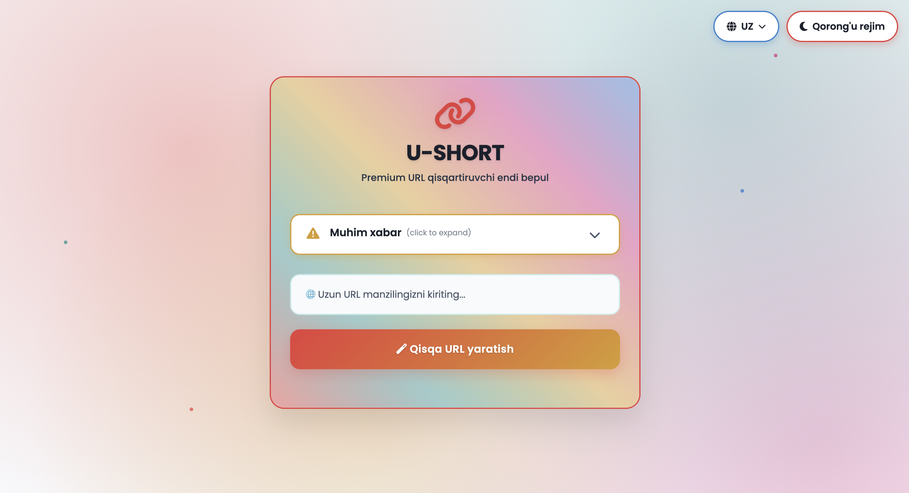

# U-SHORT 🔗

*Java Spring Boot, Thymeleaf va PostgreSQL bilan yaratilgan oddiy, xavfsiz va zamonaviy URL qisqartiruvchi veb-ilovasi.*



---

## 📌 Dastur haqida

**U-SHORT** — bu ochiq manbali, Spring Boot, Thymeleaf va PostgreSQL texnologiyalarida yozilgan URL qisqartiruvchi web
ilova. Oddiy foydalanish, zamonaviy interfeys va xavfsiz URL yaratish imkonini beradi.

<details style="color: orange">
  <summary>Muhim habar!</summary>

Iltimos, xizmatimiz orqali qisqartirilgan barcha URL manzillar xavfsiz, qonuniy va mas'uliyat bilan ishlatilishini ta'
minlang.
Yaratilgandan so'ng, qisqartirilgan URL manzillar doimiy bo'lib, o'zgartirib bo'lmaydi.
Biz hech qanday xakerlik, fishing, firibgarlik yoki boshqa zararli yoki noqonuniy
faoliyatni qo'llab-quvvatlamaymiz va ma'qullamaymiz. Bunday maqsadlarda xizmatni suiiste'mol qilgan har qanday
foydalanuvchi haqidagi ma'lumotlar
tegishli organlarga xabar qilinadi.
Ushbu xizmatdan foydalanish orqali siz quyidagilarni tan olasiz:
<ul>
<li>Siz qisqartirgan URL manzillarning mazmuni va manzili uchun to'liq javobgarsiz.</li>
<li>Bizning xizmatimiz hech qanday kafolat va kafolatlarsiz "bor holatida" taqdim etiladi.</li>
<li>Ushbu platforma orqali yaratilgan URL manzillarning noto'g'ri ishlatilishi yoki zarar yetkazishi uchun biz javobgar
bo'lmaymiz.
</li>
</ul>
<b>O'z xavf-xataringiz ostida foydalaning. Qonunlar va jamiyat me'yorlariga ehtiyotkor va hurmatli bo'ling.</b>
</details>

---

## ✨ Imkoniyatlari

- 🔐 Xavfsiz va noyob qisqa URL manzillar
- 📊 Kuzatuv tugmasini bosing (ixtiyoriy)
- 🌍 Shaxsiy domenni qo'llab-quvvatlash
- 🌙 Thymeleaf va Bootstrap bilan zamonaviy foydalanuvchi interfeysi
- 🗃️ PostgreSQL ma'lumotlar bazasi integratsiyasi
- 🚀 Temir yo'lda / Renderda / VPSda oson joylashtirish

---

## 🛠 Texnik jihatlari

| Layer       | Technology             |
|-------------|------------------------|
| Backend     | Spring Boot (Java 17+) |
| Frontend    | Thymeleaf + Bootstrap  |
| Database    | PostgreSQL             |
| Build Tool  | Maven                  |
| Deployments | Railway / Render       |

---

## 📦 Talablar

- Java 17+
- Maven
- PostgreSQL
- Git
- HTML
- CSS

---

## 🚀 Oson boshlash

### 1. Dasturni nushalab oling

```bash
     git clone https://github.com/asadbek-abdinazarov/u-short.git
```

### 2. Dastur file ga o'ting

```bash
     cd u-short
```

### 3. Ma'lumotlar bazasini sozlang

```yml
      datasource:
        url: jdbc:postgresql://${PGHOST}:${PGPORT}/${PGDATABASE}
        username: ${PGUSER}
        password: ${PGPASSWORD}
        driver-class-name: org.postgresql.Driver
```

### 4. Dasturning jar file ni yarating

```bash
    ./mvnw clean package
```

### 5. Yaratilgan jar file ni ishga tushiring

```bash
    java -jar target/u-short-0.0.1-SNAPSHOT.jar
```

---
Ilova ishga tushirilgandan so'ng quyidagi manzilda mavjud bo'ladi:
👉 http://localhost:8080